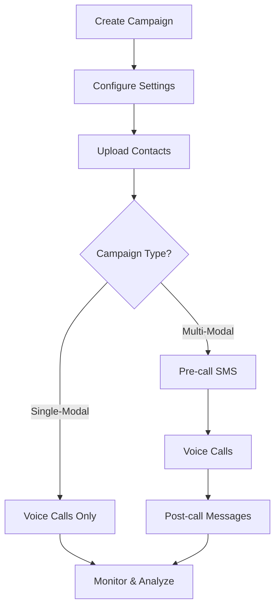

# About

Campaigns enable you to automate phone calls and messaging to multiple contacts efficiently. Whether you need simple voice-only outreach or complex multi-step communication workflows, Interactly provides the flexibility to meet your needs.

## Campaign Types

Interactly offers two types of campaigns, each designed for different communication requirements:

<CardGroup cols={2}>
  <Card title="Single-Modal Campaign" icon="phone" href="/campaigns/single-modal-campaign">
    **Voice interactions only**
    - Direct phone calls to contacts
    - Voice-based conversations with AI assistant
    - Simple, streamlined setup
    - Perfect for quick outreach and surveys
  </Card>
  
  <Card title="Multi-Modal Campaign" icon="message" href="/campaigns/multi-modal-campaign">
    **Voice + messaging capabilities**
    - Pre-call SMS notifications
    - Voice calls with AI assistant
    - Post-call follow-up messages
    - Complex communication workflows
  </Card>
</CardGroup>

## Key Differences

Understanding when to use each campaign type:

### Single-Modal Campaigns
<Card title="Best for:" icon="check">
- Simple appointment reminders
- Quick surveys or data collection
- Direct customer service calls
- Voice-only interactions
- Streamlined workflows
</Card>

**Features:**
- ✅ Voice calls with AI assistant
- ✅ Real-time call monitoring
- ✅ Webhook integrations
- ✅ Call outcome tracking
- ❌ No SMS messaging
- ❌ No pre/post-call notifications

### Multi-Modal Campaigns
<Card title="Best for:" icon="message">
- Complex customer journeys
- Appointment confirmations with reminders
- Follow-up sequences
- Mixed communication preferences
- Enhanced engagement workflows
</Card>

**Features:**
- ✅ Everything from single-modal campaigns
- ✅ Pre-call SMS notifications
- ✅ Post-call follow-up messages
- ✅ Multiple outcome-based messaging
- ✅ Call status-specific notifications
- ✅ Advanced workflow management

## Campaign Features

All campaigns include these core capabilities:

<AccordionGroup>
  <Accordion title="AI Assistant Integration">
    - Choose from your configured AI assistants
    - Customize conversation flows and responses
    - Dynamic variable support in conversations
    - Real-time conversation handling
  </Accordion>
  
  <Accordion title="Contact Management">
    - Bulk contact upload via CSV
    - Dynamic variable support
    - Contact validation and processing
    - Real-time contact status tracking
  </Accordion>
  
  <Accordion title="Scheduling & Timing">
    - Flexible date and time scheduling
    - Time zone support
    - Start and end time configuration
    - Parallel call management
  </Accordion>
  
  <Accordion title="Monitoring & Analytics">
    - Real-time campaign status
    - Individual call tracking
    - Success and failure metrics
    - Campaign performance reports
  </Accordion>
  
  <Accordion title="Webhook Integration">
    - Real-time status updates
    - Call completion notifications
    - Campaign report webhooks
    - Custom header support
  </Accordion>
</AccordionGroup>

## Getting Started

<Steps>
  <Step title="Choose Campaign Type">
    Decide between single-modal (voice only) or multi-modal (voice + messaging) based on your communication needs.
  </Step>
  
  <Step title="Create Your Campaign">
    Navigate to the dashboard, select the **Campaigns** tab, and click **New Campaign**.
  </Step>
  
  <Step title="Configure Settings">
    Set up your campaign with assistant selection, timing, and notification preferences.
  </Step>
  
  <Step title="Upload Contacts">
    Add your contact list with the required fields for your campaign type.
  </Step>
  
  <Step title="Launch & Monitor">
    Launch your campaign and monitor progress through the dashboard and webhooks.
  </Step>
</Steps>

## API Integration

<Card title="Programmatic Campaign Management" icon="code">
All campaign features available in the dashboard can also be accessed programmatically via our API.
</Card>

**Available via API:**
- ✅ Campaign creation and configuration
- ✅ Contact management and bulk uploads
- ✅ Campaign scheduling and timing control
- ✅ Real-time status monitoring
- ✅ Campaign control operations (pause, resume, stop)
- ✅ Reporting and analytics data

<CardGroup cols={2}>
  <Card title="Create Campaigns API" icon="rocket" href="/api-reference/campaigns/campaigns/create-campaigns">
    **POST /api/campaigns**  
    Create and configure campaigns programmatically with full feature parity to the dashboard
  </Card>

  <Card title="Campaign Management APIs" icon="settings" href="/api-reference/campaigns/campaigns/get-campaign-by-id">
    **Complete Details API**  
    Access, monitor, and control campaigns via dedicated endpoints
  </Card>
</CardGroup>

<Info>
Perfect for integrating campaign creation into your existing workflows, CRM systems, or automated processes.
</Info>

## Campaign Workflow

<Tip>
All campaigns follow a similar workflow pattern, with multi-modal campaigns adding messaging steps.
</Tip>

## Decision Guide

<CardGroup cols={2}>
  <Card title="Use Single-Modal When:" icon="phone">
    - Only need voice interactions
    - Simple, direct communication
    - Quick surveys or confirmations
    - Streamlined workflow preferred
    - No messaging requirements
    - Cost-effective solution needed
  </Card>
  
  <Card title="Use Multi-Modal When:" icon="message">
    - Need pre-call notifications
    - Require follow-up messaging
    - Complex communication flows
    - Want to maximize engagement
    - Mixed communication preferences
    - Enhanced tracking needed
  </Card>
</CardGroup>

<Warning>
Choose your campaign type carefully. While you can clone and modify campaigns, switching between single-modal and multi-modal requires creating a new campaign.
</Warning>

## Campaign Execution & Management

Interactly's robust campaign execution system ensures reliable, scalable, and trackable campaign delivery with enterprise-grade performance and monitoring capabilities.

<AccordionGroup>
  <Accordion title="Concurrent Call Management" icon="phone-multiple">
    **Intelligent call concurrency handling ensures optimal performance:**
    
    <CardGroup cols={2}>
      <Card title="System-Managed Concurrency" icon="settings">
        - **Automatic load balancing** across available resources
        - **Smart queue management** prevents system overload
        - **Resource optimization** for maximum efficiency
        - **Dynamic scaling** based on campaign size
      </Card>
      
      <Card title="Configurable Limits" icon="sliders">
        - **Organization limits** set by Interactly team
        - **Campaign-specific limits** within org constraints
        - **Real-time monitoring** of active calls
        - **Queue depth tracking** for performance insights
      </Card>
    </CardGroup>
    
    <Info>
    Your concurrent call limits are visible in **My Organization → License**. Set campaign limits within your org capacity for optimal performance.
    </Info>
  </Accordion>
  
  <Accordion title="Campaign Completion Guarantee" icon="check-shield">
    **Every campaign call is processed to completion:**
    
    <Steps>
      <Step title="Systematic Processing">
        All uploaded contacts are validated and queued for processing with guaranteed execution
      </Step>
      
      <Step title="Retry Mechanisms">
        - **Automatic retries** for temporary technical failures
        - **Intelligent backoff** to handle busy networks
        - **Error classification** to determine retry eligibility
      </Step>
      
      <Step title="Completion Tracking">
        - **Real-time status updates** for each contact
        - **Final state guarantee** (completed, failed, or error)
        - **No abandoned calls** - every contact reaches a final state
      </Step>
    </Steps>
    
    <Card title="Completion States" icon="list-check">
    ✅ **Successfully completed** - Call connected and finished  
    ✅ **Failed with reason** - Unable to connect with clear error  
    ✅ **Technical error** - System issue documented for analysis  
    </Card>
  </Accordion>
  
  <Accordion title="Precise Timing Control" icon="clock-shield">
    **Campaigns execute exactly when and how you specify:**
    
    <CardGroup cols={2}>
      <Card title="Date & Time Precision" icon="calendar-check">
        - **Exact start time** execution down to the minute
        - **Time zone awareness** for global campaigns
        - **End time enforcement** - no calls after specified time
        - **Business hours respect** for compliance
      </Card>
      
      <Card title="Scheduling Intelligence" icon="brain">
        - **Pre-call SMS timing** integration for multi-modal
        - **Queue management** ensures on-time delivery
        - **Resource allocation** prevents timing conflicts
        - **Automatic adjustments** for optimal contact times
      </Card>
    </CardGroup>
    
    <Warning>
    Campaign timing is strictly enforced. Calls will not be initiated after the specified end time, even if queued contacts remain.
    </Warning>
  </Accordion>
  
  <Accordion title="Automated Reporting & Notifications" icon="chart-bar-shield">
    **Comprehensive reporting delivered automatically upon completion:**
    
    <CardGroup cols={2}>
      <Card title="Webhook Integration" icon="webhook">
        **Real-time updates via webhooks:**
        - **Call status events** for individual call tracking
        - **Campaign completion reports** with full summary
        - **Custom headers** for authentication and routing
        - **Retry logic** ensures delivery reliability
      </Card>
      
      <Card title="Email Notifications" icon="mail">
        **Automatic email reports:**
        - **Campaign launch confirmations**
        - **Progress milestone updates**
        - **Completion summaries** with key metrics
        - **Error alerts** for immediate attention
      </Card>
    </CardGroup>
    
    <Accordion title="Report Content Details">
    **Campaign completion reports include:**
    - Total contacts processed
    - Successful call completions
    - Failed attempts with reasons
    - Average call duration and outcomes
    - Performance metrics and insights
    - Detailed logs for compliance and analysis
    </Accordion>
  </Accordion>
  
  <Accordion title="Real-Time Dashboard Monitoring" icon="monitor-dashboard">
    **Complete visibility into campaign execution:**
    
    <Steps>
      <Step title="Live Campaign Status">
        **Monitor campaign progress in real-time:**
        - **Overall campaign state** (Processing, Paused, Completed)
        - **Active call count** and queue depth
        - **Completion percentage** with visual progress bars
        - **Performance metrics** updated continuously
      </Step>
      
      <Step title="Individual Call Tracking">
        **Detailed call-level monitoring:**
        - **Call status progression** (Queued → Ringing → Processing → Complete)
        - **Outcome tracking** with detailed results
        - **Error logging** for failed attempts
        - **Conversation summaries** and collected data
      </Step>
      
      <Step title="Interactive Controls">
        **Manage running campaigns:**
        - **Pause/Resume** campaigns during execution
        - **Stop campaigns** early if needed
        - **Add contacts** to running campaigns
        - **Monitor resource usage** and performance
      </Step>
    </Steps>
    
    <Card title="Dashboard Features" icon="eye">
    📊 **Real-time metrics** and performance graphs  
    🔍 **Drill-down capabilities** for detailed analysis  
    🎛️ **Campaign controls** for immediate action  
    📈 **Historical tracking** for trend analysis  
    </Card>
  </Accordion>
</AccordionGroup>

<Tip>
**Best Practice**: Set up both webhook endpoints and email notifications for comprehensive campaign monitoring. Use webhooks for real-time integrations and email for human oversight.
</Tip>

## Next Steps

Ready to create your first campaign? Choose your approach:

<CardGroup cols={2}>
  <Card title="Single-Modal Campaign" icon="phone" href="/campaigns/single-modal-campaign">
    Start with voice-only campaigns for straightforward communication needs
  </Card>
  
  <Card title="Multi-Modal Campaign" icon="message" href="/campaigns/multi-modal-campaign">
    Create comprehensive campaigns with voice and messaging capabilities
  </Card>

  <Card title="Campaign APIs" icon="code" href="/api-reference/campaigns/campaigns/create-campaigns">
    Integrate campaign creation and management into your applications
  </Card>

  <Card title="Campaign Action APIs" icon="code" href="/api-reference/campaigns/campaigns/action-campaign-by-id">
    Control running campaigns programmatically (pause, resume, stop)
  </Card>
</CardGroup>
