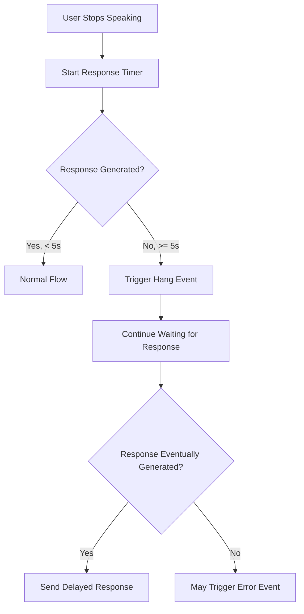

import AssistantObject from "/snippets/objects/assistant-object.mdx";
import CallObject from "/snippets/objects/call-object.mdx";
import MessagesObject from "/snippets/objects/messages-object.mdx";
import HangEventExample from "/snippets/events/hang-example.mdx";

The `hang` event is triggered when the assistant fails to respond for 5+ seconds during a conversation. This indicates potential issues with LLM processing, connectivity, or system overload.

<Warning>
    Hang events signal critical performance problems that can lead to poor user experience and call abandonment. Immediate investigation is recommended.
</Warning>

## When It's Triggered

This event is sent when:
- The assistant takes longer than 5 seconds to generate a response
- LLM API calls experience high latency or timeouts
- System processing queues become backlogged
- Network connectivity issues affect response generation

## Event Structure

```json
{
    "message": {
        "timestamp": 1772702490000,
        "type": "hang",
        "call": { /* Call Object */ },
        "assistant": { /* Assistant Object */ },
        "messages": [ /* Conversation up to hang */ ],
        "phone": { /* Phone Object */ },
        "customer": { /* Customer Object */ },
        "analysis": { /* Empty during hang */ }
    }
}
```

## Key Fields

| Field               | Type   | Description                                  |
| ------------------- | ------ | -------------------------------------------- |
| `message.type`      | string | Always "hang" for this event                 |
| `message.timestamp` | number | Unix timestamp when hang was detected        |
| `call.status`       | string | Typically "ongoing" when hang occurs         |
| `messages`          | array  | Conversation history up to the point of hang |

<CallObject />

<AssistantObject />

<MessagesObject />

## Hang Detection Logic



## Example Payload

<CodeGroup>

    ```json Hang Event
    {
      "message": {
        "timestamp": 1772702490000,
        "type": "hang",
        "call": {
          "id": "WC-82015760-c3bd-427d-a23b-ba9b07e4ab85",
          "teamId": "67c0231ae6880fe48ef929ee",
          "assistantId": "697769ef5e6d94d5ad83e01e",
          "status": "ongoing",
          "assistantCallDuration": 15000
        },
        "assistant": {
          "_id": "697769ef5e6d94d5ad83e01e",
          "name": "Mary Dental - main",
          "assistantProvider": "gemini",
          "assistantModel": "gemini-3-flash-preview"
        },
        "messages": [
          {
            "messageId": "welcome-1",
            "role": "assistant",
            "text": "Welcome to Apollo clinic!!",
            "timestamp": 1772702480279
          },
          {
            "messageId": "user-1",
            "role": "user",
            "text": "I need to book an appointment for a complex procedure",
            "timestamp": 1772702485138
          }
        ],
        "customer": {
          "number": "web-Ramesh Naik"
        }
      }
    }
    ```

</CodeGroup>

## Common Causes

### LLM Provider Issues
- API rate limiting or throttling
- Provider service outages or degraded performance
- Model capacity limitations during peak hours
- Authentication or billing issues

### System Resource Constraints
- High CPU or memory usage on Interactly servers
- Processing queue backlog
- Database connection limitations
- Network bandwidth constraints

### Complex Queries
- User requests requiring extensive reasoning
- Long conversation context requiring more processing time
- Queries that trigger multiple LLM function calls
- Malformed or problematic user input

## Response Strategies

### Immediate Alerting
```python
def handle_hang_event(event_data):
    call = event_data["message"]["call"]
    assistant = event_data["message"]["assistant"]
    timestamp = event_data["message"]["timestamp"]

    # Immediate alert to operations team
    alert_data = {
        "alert_type": "assistant_hang",
        "call_id": call["id"],
        "assistant_id": assistant["_id"],
        "assistant_name": assistant["name"],
        "provider": assistant["assistantProvider"],
        "model": assistant["assistantModel"],
        "hang_duration": "5+ seconds",
        "timestamp": timestamp,
        "severity": "high"
    }

    send_immediate_alert(alert_data)

    # Log for analysis
    logger.critical(f"Assistant hang detected: {call['id']}")
```

### Performance Monitoring
```python
def track_hang_metrics(event_data):
    call = event_data["message"]["call"]
    assistant = event_data["message"]["assistant"]

    # Increment hang counters
    metrics.increment("assistant.hang.count", tags={
        "assistant_id": assistant["_id"],
        "provider": assistant["assistantProvider"],
        "model": assistant["assistantModel"]
    })

    # Track by time of day for pattern analysis
    hour_of_day = datetime.fromtimestamp(
        event_data["message"]["timestamp"] / 1000
    ).hour

    metrics.increment("assistant.hang.by_hour", tags={
        "hour": hour_of_day,
        "provider": assistant["assistantProvider"]
    })
```

### Automated Remediation
```python
def auto_remediate_hang(event_data):
    call = event_data["message"]["call"]
    assistant = event_data["message"]["assistant"]

    # Check for patterns indicating system issues
    recent_hangs = get_recent_hangs(assistant["_id"], minutes=10)

    if len(recent_hangs) >= HANG_THRESHOLD:
        # Multiple hangs suggest systematic issue

        # Option 1: Switch to backup provider/model
        if assistant["assistantProvider"] == "openai":
            switch_assistant_provider(call["id"], "anthropic")

        # Option 2: Reduce response complexity
        adjust_assistant_parameters(call["id"], {
            "maxTokens": 100,  # Shorter responses
            "temperature": 0.3  # More deterministic
        })

        # Option 3: Graceful degradation message
        queue_fallback_response(call["id"],
            "I apologize for the delay. Let me help you with that.")
```

### Pattern Analysis
```python
def analyze_hang_patterns():
    # Get recent hang events
    recent_hangs = db.hang_events.find({
        "timestamp": {"$gte": datetime.utcnow() - timedelta(hours=24)}
    })

    # Group by various dimensions
    patterns = {
        "by_provider": defaultdict(int),
        "by_model": defaultdict(int),
        "by_assistant": defaultdict(int),
        "by_hour": defaultdict(int),
        "by_conversation_length": defaultdict(int)
    }

    for hang in recent_hangs:
        assistant = hang["message"]["assistant"]
        timestamp = hang["message"]["timestamp"]
        messages = hang["message"]["messages"]

        patterns["by_provider"][assistant["assistantProvider"]] += 1
        patterns["by_model"][assistant["assistantModel"]] += 1
        patterns["by_assistant"][assistant["_id"]] += 1

        hour = datetime.fromtimestamp(timestamp / 1000).hour
        patterns["by_hour"][hour] += 1

        msg_count = len(messages)
        patterns["by_conversation_length"][f"{msg_count//5*5}-{msg_count//5*5+4}"] += 1

    # Generate insights
    generate_hang_insights(patterns)
```

## User Experience Impact

Hang events directly affect user experience:

### User Behavior During Hangs
- Users may repeat their question
- Users might hang up if wait is too long
- Users experience frustration and reduced trust
- Call abandonment rate increases significantly

### Mitigation Strategies
```python
def implement_hang_mitigation():
    # Strategy 1: Proactive timeout warnings
    # After 3 seconds of processing, play hold message

    # Strategy 2: Streaming responses
    # Start playing response as it's generated

    # Strategy 3: Fallback responses
    fallback_responses = [
        "Let me think about that for a moment...",
        "I'm processing your request, please hold on...",
        "That's a great question, give me just a second..."
    ]

    # Strategy 4: Context reduction
    # If conversation is very long, summarize for faster processing
```

## Prevention Best Practices

### Assistant Configuration
```json
{
    "assistantModel": "gpt-4o-mini",  // Faster models for time-sensitive uses
    "assistantMaxTokens": 150,        // Limit response length
    "assistantTemperature": 0.3,      // More deterministic = faster
    "assistantSystemPrompt": "Keep responses concise and direct. Aim for 1-2 sentences maximum."
}
```

### Monitoring Thresholds
```python
# Set up monitoring for early warning signs
MONITORING_RULES = {
    "response_time_p95": {
        "threshold": 3000,  # 3 seconds
        "alert": "warning"
    },
    "hang_rate": {
        "threshold": 0.05,  # 5% of calls
        "window": "1h",
        "alert": "critical"
    },
    "provider_error_rate": {
        "threshold": 0.02,  # 2% error rate
        "alert": "warning"
    }
}
```

### Load Balancing
```python
def implement_provider_fallback():
    # Primary: Fast, reliable provider
    # Secondary: Backup with different characteristics

    provider_config = {
        "primary": {
            "provider": "openai",
            "model": "gpt-4o-mini",
            "max_tokens": 150
        },
        "fallback": {
            "provider": "anthropic",
            "model": "claude-3-haiku",
            "max_tokens": 100
        }
    }
```

## Recovery Actions

When hang events occur:

1. **Monitor**: Track if response eventually comes through
2. **Alert**: Notify engineering team for investigation
3. **Document**: Record context for post-incident analysis
4. **Optimize**: Adjust assistant settings to prevent recurrence
5. **Communicate**: Update users about potential temporary delays

<Card title="Related Events" icon="link">
    Hang events often precede [error events](/webhooks/events/error) if the underlying issue persists
</Card>

<HangEventExample />
