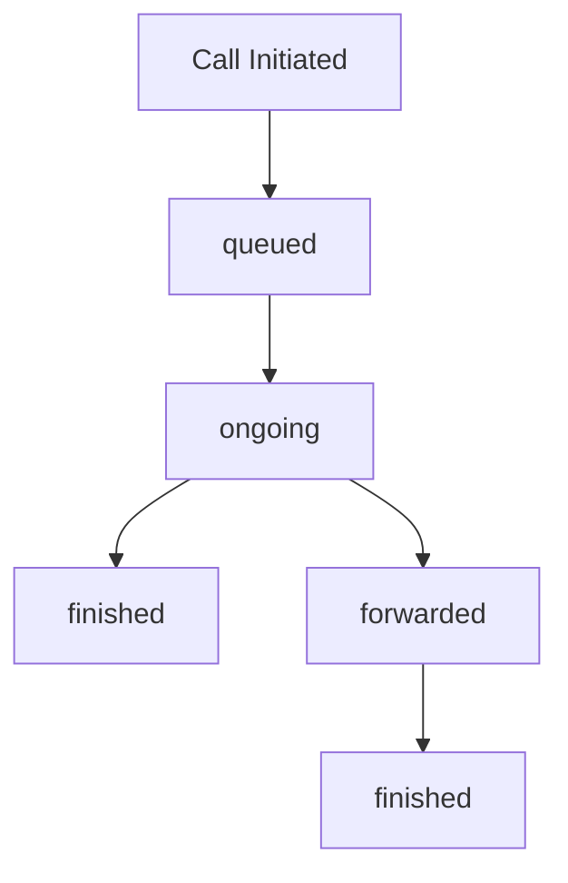

import AssistantObject from "/snippets/objects/assistant-object.mdx";
import CallObject from "/snippets/objects/call-object.mdx";
import PhoneObject from "/snippets/objects/phone-object.mdx";
import CustomerObject from "/snippets/objects/customer-object.mdx";
import StatusUpdateEventExample from "/snippets/events/status-update-example.mdx";


The `status-update` event is triggered whenever a call status changes occur, such as when a call transitions between queued, ongoing, finished, or forwarded states.

<Info>
  This event provides real-time visibility into call progression and is essential for tracking call lifecycle in your systems.
</Info>

## When It's Triggered

Status update events are sent when the call moves through these states:

| Status      | Description                                         | Timing             |
| ----------- | --------------------------------------------------- | ------------------ |
| `queued`    | The call has been initiated and is waiting to start | Call initiation    |
| `ongoing`   | The call has started and conversation is active     | Call pickup/answer |
| `finished`  | The call has ended successfully                     | Call termination   |
| `forwarded` | The call has been forwarded to another destination  | Call forwarding    |

## Event Structure

```json
{
    "message": {
        "timestamp": 1772702480032,
        "type": "status-update",
        "call": { /* Call Object */ },
        "assistant": { /* Assistant Object */ },
        "phone": { /* Phone Object */ },
        "customer": { /* Customer Object */ },
        "analysis": { /* Empty during status updates */ }
    }
}
```

## Key Fields

| Field                        | Type   | Description                                                   |
| ---------------------------- | ------ | ------------------------------------------------------------- |
| `message.type`               | string | Always "status-update" for this event                         |
| `message.timestamp`          | number | Unix timestamp when status change occurred (milliseconds)     |
| `call.status`                | string | New call status: "queued", "ongoing", "finished", "forwarded" |
| `call.phoneCallStatus`       | string | Detailed phone system status                                  |
| `call.phoneCallStatusReason` | string | Human-readable explanation of the status                      |

<CallObject />

<AssistantObject />

<PhoneObject />

<CustomerObject />

<Warning>
  The `analysis` object is typically empty in status-update events since analysis is performed after the call completes.
</Warning>

## Example Payload

<CodeGroup>

  ```json Queued Status
  {
    "message": {
      "timestamp": 1772702480032,
      "type": "status-update",
      "call": {
        "id": "WC-82015760-c3bd-427d-a23b-ba9b07e4ab85",
        "teamId": "67c0231ae6880fe48ef929ee",
        "assistantId": "697769ef5e6d94d5ad83e01e",
        "callType": "web",
        "direction": "inbound",
        "startAt": "2026-03-05T09:21:19.627Z",
        "userNumber": "web-Ramesh Naik",
        "assistantNumber": "697769ef5e6d94d5ad83e01e",
        "status": "queued",
        "phoneCallStatus": "in-progress",
        "phoneCallStatusReason": "Call is in progress",
        "callEndTriggerBy": "",
        "assistantCallDuration": 0
      },
      "assistant": {
        "_id": "697769ef5e6d94d5ad83e01e",
        "name": "Mary Dental - main",
        "welcomeMessage": "Welcome to Apollo clinic!!"
      }
    }
  }
  ```

  ```json Ongoing Status
  {
    "message": {
      "timestamp": 1772702485000,
      "type": "status-update",
      "call": {
        "id": "WC-82015760-c3bd-427d-a23b-ba9b07e4ab85",
        "status": "ongoing",
        "phoneCallStatus": "in-progress",
        "phoneCallStatusReason": "Call is in progress"
      }
    }
  }
  ```

  ```json Finished Status
  {
    "message": {
      "timestamp": 1772702523000,
      "type": "status-update",
      "call": {
        "id": "WC-82015760-c3bd-427d-a23b-ba9b07e4ab85",
        "status": "finished",
        "phoneCallStatus": "completed",
        "phoneCallStatusReason": "Call is completed",
        "callEndTriggerBy": "bot",
        "assistantCallDuration": 41683
      }
    }
  }
  ```

</CodeGroup>

## Common Use Cases

### Call Tracking Dashboard
```python
def handle_status_update(event_data):
    call = event_data["message"]["call"]
    call_id = call["id"]
    new_status = call["status"]

    # Update call tracking database
    db.calls.update_one(
        {"call_id": call_id},
        {
            "$set": {
                "status": new_status,
                "last_updated": datetime.utcnow(),
                "duration": call.get("assistantCallDuration", 0)
            }
        }
    )

    # Send real-time updates to dashboard
    emit_to_dashboard(call_id, new_status)
```

### Notification System
```python
def send_status_notifications(event_data):
    call = event_data["message"]["call"]
    status = call["status"]
    assistant_name = event_data["message"]["assistant"]["name"]

    if status == "queued":
        notify_agents(f"New call queued for {assistant_name}")
    elif status == "ongoing":
        notify_agents(f"Call started with {assistant_name}")
    elif status == "finished":
        notify_agents(f"Call completed - Duration: {call['assistantCallDuration']}ms")
```

### Call Analytics
```javascript
const handleStatusUpdate = (eventData) => {
  const { call, timestamp } = eventData.message;

  // Track call lifecycle timing
  analytics.track('call_status_change', {
    call_id: call.id,
    status: call.status,
    assistant_id: call.assistantId,
    call_type: call.callType,
    direction: call.direction,
    timestamp: timestamp
  });

  // Calculate metrics
  if (call.status === 'finished') {
    const duration = call.assistantCallDuration;
    analytics.track('call_completed', {
      call_id: call.id,
      duration_ms: duration,
      end_trigger: call.callEndTriggerBy
    });
  }
};
```

## Status Transition Flow



## Error Handling

Always handle missing fields gracefully, as different statuses may include different data:

```python
def safe_status_handler(event_data):
    try:
        call = event_data["message"]["call"]
        status = call.get("status", "unknown")

        # Duration only available for finished calls
        duration = call.get("assistantCallDuration")
        if duration is not None:
            duration_seconds = duration / 1000

        # End trigger only relevant for finished calls
        end_trigger = call.get("callEndTriggerBy", "")

        process_status_update(call["id"], status, duration, end_trigger)

    except KeyError as e:
        logger.error(f"Missing required field: {e}")
    except Exception as e:
        logger.error(f"Status update processing failed: {e}")
```

<StatusUpdateEventExample />
