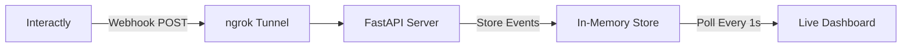

Go beyond terminal logs — build a **live events dashboard** that captures webhook events in real time and displays conversation messages in a chat-like UI you can monitor from your browser.

<Info>
    This guide builds on the [ngrok setup](/webhooks/events/testing/ngrok-setup). Make sure you have ngrok installed and authenticated before proceeding.
</Info>

## What You'll Build



A FastAPI-powered webhook receiver that:

<CardGroup cols={2}>
    <Card title="Capture Events" icon="inbox">
        Receives and stores `status-update` and `conversation-update` events per call in memory
    </Card>
    <Card title="Live Chat View" icon="messages">
        Renders user and assistant messages in a real-time chat bubble interface
    </Card>
    <Card title="Multi-Call Support" icon="phone-flip">
        Tracks multiple simultaneous calls with a conversation selector dropdown
    </Card>
    <Card title="Auto-Refresh" icon="rotate">
        Polls the server every second and auto-scrolls to the latest messages
    </Card>
</CardGroup>

<Frame caption="Example of the live events dashboard showing a conversation with status pills and chat bubbles.">
    
</Frame>

## Prerequisites

- Python 3.8+
- ngrok installed and authenticated
- An Interactly assistant with webhooks enabled

## Architecture Overview

The system has two parts:

<Steps>
    <Step title="Backend — FastAPI webhook receiver">
        A Python server that accepts incoming webhook POST requests, parses `status-update` and `conversation-update` events, deduplicates messages, and exposes REST endpoints to query stored data.
    </Step>
    <Step title="Frontend — HTML live dashboard">
        A single-page HTML file served by the same FastAPI server. It polls the backend every few seconds, lets you pick a conversation, and renders messages in a chat-style layout with auto-refresh.
    </Step>
</Steps>

---

## Step 1: Install Dependencies

```bash
mkdir interactly-live-events && cd interactly-live-events

python3 -m venv venv
source venv/bin/activate   # Windows: venv\Scripts\activate

pip3 install fastapi uvicorn
```

<Note>
    We only need **FastAPI** and **Uvicorn** — no database, no extra libraries. Events are stored in memory for simplicity.
</Note>

## Step 2: Create the Webhook Server

Create `server.py` — this is the core of the live events system:

```python server.py
from datetime import datetime
import os

from fastapi import FastAPI, Body, Request
from fastapi.responses import JSONResponse, HTMLResponse

app = FastAPI(title="Interactly Live Events")

# ── In-memory event store ──────────────────────────────────
# Structure per conversation:
# {
#   "call-id-1": {
#       "statuses":  [{"status": "queued", "timestamp": 17725...}],
#       "messages":  [{"messageId": "msg-1", "role": "user", "text": "Hi", "timestamp": 17725...}],
#       "events":    [<raw webhook payloads>]
#   }
# }
event_store: dict = {}


# ── Helpers ─────────────────────────────────────────────────
def ts_label(timestamp_ms: int) -> str:
    """Convert epoch-ms to HH:MM:SS.mmm for logging."""
    dt = datetime.fromtimestamp(timestamp_ms / 1000.0)
    return dt.strftime("%H:%M:%S.%f")[:-3]


def ensure_conversation(call_id: str):
    """Initialise the store entry for a new call if it doesn't exist."""
    if call_id not in event_store:
        event_store[call_id] = {"statuses": [], "messages": [], "events": []}


# ── Event parsers ───────────────────────────────────────────
def handle_status_update(event: dict):
    """Extract status from a status-update webhook and store it."""
    msg = event.get("message", {})
    call = msg.get("call", {})
    call_id = call.get("id")
    if not call_id:
        return

    ensure_conversation(call_id)
    status = call.get("status", "unknown")
    timestamp = msg.get("timestamp", 0)

    event_store[call_id]["statuses"].append(
        {"status": status, "timestamp": timestamp}
    )
    print(f"[{ts_label(timestamp)}] 📞 {call_id[:12]}… → {status.upper()}")


def handle_conversation_update(event: dict):
    """Extract new messages from a conversation-update webhook, deduplicating by messageId."""
    msg = event.get("message", {})
    call_id = msg.get("call", {}).get("id")
    if not call_id:
        return

    ensure_conversation(call_id)
    existing_ids = {m["messageId"] for m in event_store[call_id]["messages"]}

    for m in msg.get("messages", []):
        mid = m.get("messageId")
        if mid and mid not in existing_ids:
            entry = {
                "messageId": mid,
                "role": m.get("role", "unknown"),
                "text": m.get("text", ""),
                "timestamp": m.get("timestamp", 0),
            }
            event_store[call_id]["messages"].append(entry)
            existing_ids.add(mid)
            print(f"[{ts_label(entry['timestamp'])}] 💬 {entry['role']}: {entry['text'][:80]}")


# ── Routes: Webhook receiver ───────────────────────────────
@app.post("/webhook")
async def receive_webhook(event: dict = Body(...)):
    """
    Main webhook endpoint — Interactly sends events here.
    Dispatches to the appropriate handler based on event type.
    """
    msg = event.get("message", {})
    event_type = msg.get("type", "")
    call_id = msg.get("call", {}).get("id")

    if call_id:
        ensure_conversation(call_id)
        event_store[call_id]["events"].append(event)

    if event_type == "status-update":
        handle_status_update(event)
    elif event_type == "conversation-update":
        handle_conversation_update(event)
    else:
        print(f"ℹ️  Received event type: {event_type}")

    return JSONResponse({"status": "ok"})


# ── Routes: Dashboard API ──────────────────────────────────
@app.get("/api/conversations")
async def list_conversations():
    """Return all conversation IDs and their stored data."""
    return JSONResponse({"conversations": event_store})


@app.get("/api/conversations/{call_id}")
async def get_conversation(call_id: str):
    """Return statuses + messages for a single conversation."""
    convo = event_store.get(call_id)
    if not convo:
        return JSONResponse({"error": "Not found"}, status_code=404)
    return JSONResponse(convo)


@app.delete("/api/conversations")
async def clear_all():
    """Wipe all stored events (useful during development)."""
    event_store.clear()
    return JSONResponse({"message": "All events cleared"})


# ── Routes: Serve the dashboard HTML ───────────────────────
@app.get("/", response_class=HTMLResponse)
async def dashboard():
    """Serve the live events dashboard."""
    html_path = os.path.join(os.path.dirname(__file__), "dashboard.html")
    with open(html_path) as f:
        return HTMLResponse(f.read())


# ── Entrypoint ─────────────────────────────────────────────
if __name__ == "__main__":
    import uvicorn

    PORT = int(os.environ.get("PORT", 8000))
    print(f"🚀 Live Events Server starting on port {PORT}")
    print(f"📡 Webhook endpoint : http://localhost:{PORT}/webhook")
    print(f"🖥️  Dashboard        : http://localhost:{PORT}/")
    uvicorn.run(app, host="0.0.0.0", port=PORT)
```

### How the server works

<AccordionGroup>
    <Accordion title="In-memory event store">
        `event_store` is a plain Python dict keyed by **call ID**. Each entry holds three lists — `statuses`, `messages`, and raw `events`. No database setup required; data resets when you restart the server.
    </Accordion>
    <Accordion title="Message deduplication">
        Interactly sends **all** messages accumulated so far with every `conversation-update` event. The server tracks seen `messageId` values in a set and only appends genuinely new messages — so your dashboard never shows duplicates.
    </Accordion>
    <Accordion title="Dual-purpose server">
        The same FastAPI instance serves the webhook endpoint (`POST /webhook`), the REST API (`GET /api/conversations`), **and** the HTML dashboard (`GET /`). One process, one port — no CORS issues.
    </Accordion>
</AccordionGroup>

## Step 3: Create the Live Dashboard

Create `dashboard.html` in the same directory as `server.py`:

```html dashboard.html
<!DOCTYPE html>
<html lang="en">
<head>
    <meta charset="UTF-8" />
    <meta name="viewport" content="width=device-width, initial-scale=1.0" />
    <title>Interactly — Live Events</title>
    <style>
        * { margin: 0; padding: 0; box-sizing: border-box; }
        body { font-family: -apple-system, BlinkMacSystemFont, 'Segoe UI', Roboto, sans-serif; background: #f0f2f5; padding: 24px; }
        .shell { max-width: 960px; margin: auto; }

        /* ── Header ─────────────────────────────── */
        .header { background: #fff; border-radius: 12px; padding: 20px 24px; margin-bottom: 16px;
                   box-shadow: 0 1px 3px rgba(0,0,0,.08); display: flex; justify-content: space-between; align-items: center; }
        .header h1 { font-size: 20px; color: #1a1a2e; }
        .header .actions { display: flex; gap: 10px; align-items: center; }
        .badge { font-size: 12px; padding: 4px 10px; border-radius: 20px; }
        .badge.live { background: #d4edda; color: #155724; }
        .badge.paused { background: #fff3cd; color: #856404; }
        select { padding: 8px 12px; border: 1px solid #d1d5db; border-radius: 6px; font-size: 14px; min-width: 220px; }
        button { padding: 8px 14px; border: none; border-radius: 6px; cursor: pointer; font-size: 13px; font-weight: 500; }
        .btn-red { background: #fee2e2; color: #991b1b; }
        .btn-red:hover { background: #fecaca; }
        .btn-blue { background: #dbeafe; color: #1e40af; }
        .btn-blue:hover { background: #bfdbfe; }

        /* ── Status pills ───────────────────────── */
        .status-bar { display: flex; flex-wrap: wrap; gap: 8px; margin-bottom: 16px; }
        .pill { padding: 5px 12px; border-radius: 20px; font-size: 12px; background: #e8eaf6; color: #283593; }

        /* ── Chat area ──────────────────────────── */
        .chat { background: #fff; border-radius: 12px; box-shadow: 0 1px 3px rgba(0,0,0,.08);
                 height: 520px; overflow-y: auto; padding: 20px; display: flex; flex-direction: column; gap: 12px; }
        .chat .empty { margin: auto; color: #9ca3af; font-style: italic; }
        .bubble-row { display: flex; }
        .bubble-row.user { justify-content: flex-end; }
        .bubble-row.assistant { justify-content: flex-start; }
        .bubble { max-width: 65%; padding: 10px 16px; border-radius: 16px; font-size: 14px; line-height: 1.5; }
        .bubble-row.user .bubble { background: #1E6EFF; color: #fff; border-bottom-right-radius: 4px; }
        .bubble-row.assistant .bubble { background: #f3f4f6; color: #1f2937; border-bottom-left-radius: 4px; }
        .meta { font-size: 10px; margin-top: 4px; opacity: .6; }
        .bubble-row.user .meta { text-align: right; }
    </style>
</head>
<body>
<div class="shell">
    <!-- Header -->
    <div class="header">
        <h1>📡 Live Events Dashboard</h1>
        <div class="actions">
            <select id="callSelect"><option value="">Waiting for calls…</option></select>
            <button class="btn-blue" id="toggleBtn" onclick="togglePolling()">⏸ Pause</button>
            <button class="btn-red" onclick="clearAll()">🗑 Reset</button>
            <span class="badge live" id="statusBadge">● Live</span>
        </div>
    </div>

    <!-- Status pills -->
    <div class="status-bar" id="statusBar"></div>

    <!-- Chat messages -->
    <div class="chat" id="chat">
        <span class="empty">Make a call — messages will appear here in real time.</span>
    </div>
</div>

<script>
    // ── State ───────────────────────────────────────
    let polling = true;
    let currentCall = null;
    let knownCallIds = [];

    // ── Bootstrap ───────────────────────────────────
    (function boot() {
        setInterval(tick, 1500);
        tick();
    })();

    // ── Main loop ───────────────────────────────────
    async function tick() {
        if (!polling) return;
        try {
            const res  = await fetch('/api/conversations');
            const data = await res.json();
            const ids  = Object.keys(data.conversations || {});

            // Update dropdown when new calls arrive
            if (ids.toString() !== knownCallIds.toString()) {
                knownCallIds = ids;
                rebuildDropdown(ids);
            }

            // Auto-select latest call if none chosen
            if (!currentCall && ids.length) {
                currentCall = ids[ids.length - 1];
                document.getElementById('callSelect').value = currentCall;
            }

            if (currentCall && data.conversations[currentCall]) {
                renderCall(data.conversations[currentCall]);
            }
        } catch (e) { console.error('poll error', e); }
    }

    // ── Render helpers ──────────────────────────────
    function rebuildDropdown(ids) {
        const sel = document.getElementById('callSelect');
        const prev = sel.value;
        sel.innerHTML = '<option value="">Select a call…</option>';
        ids.forEach(id => {
            const opt = document.createElement('option');
            opt.value = id;
            opt.textContent = id.length > 30 ? id.slice(0, 14) + '…' + id.slice(-10) : id;
            sel.appendChild(opt);
        });
        if (prev && ids.includes(prev)) sel.value = prev;
    }

    function renderCall(convo) {
        // Status pills
        const bar = document.getElementById('statusBar');
        bar.innerHTML = (convo.statuses || [])
            .map(s => `<span class="pill">${s.status} — ${fmtTime(s.timestamp)}</span>`)
            .join('');

        // Chat bubbles
        const chat = document.getElementById('chat');
        const wasAtBottom = chat.scrollTop + chat.clientHeight >= chat.scrollHeight - 10;

        if (!convo.messages || convo.messages.length === 0) {
            chat.innerHTML = '<span class="empty">No messages yet…</span>';
            return;
        }

        chat.innerHTML = convo.messages.map(m => `
            <div class="bubble-row ${esc(m.role)}">
                <div class="bubble">
                    ${esc(m.text)}
                    <div class="meta">${esc(m.role)} · ${fmtTime(m.timestamp)}</div>
                </div>
            </div>`).join('');

        if (wasAtBottom) chat.scrollTop = chat.scrollHeight;
    }

    // ── Utilities ───────────────────────────────────
    function fmtTime(ts) {
        if (!ts) return '';
        return new Date(ts).toLocaleTimeString();
    }
    function esc(str) {
        const d = document.createElement('div');
        d.textContent = str || '';
        return d.innerHTML;
    }

    // ── Controls ────────────────────────────────────
    document.getElementById('callSelect').addEventListener('change', function () {
        currentCall = this.value || null;
        if (currentCall) tick();
    });

    function togglePolling() {
        polling = !polling;
        const btn = document.getElementById('toggleBtn');
        const badge = document.getElementById('statusBadge');
        btn.textContent = polling ? '⏸ Pause' : '▶ Resume';
        badge.textContent = polling ? '● Live' : '● Paused';
        badge.className = polling ? 'badge live' : 'badge paused';
        if (polling) tick();
    }

    async function clearAll() {
        if (!confirm('Clear all captured events?')) return;
        await fetch('/api/conversations', { method: 'DELETE' });
        currentCall = null;
        knownCallIds = [];
        document.getElementById('callSelect').innerHTML = '<option value="">Waiting for calls…</option>';
        document.getElementById('statusBar').innerHTML = '';
        document.getElementById('chat').innerHTML = '<span class="empty">Events cleared.</span>';
    }
</script>
</body>
</html>
```

### Dashboard features at a glance

<AccordionGroup>
    <Accordion title="Auto-discovery of new calls">
        The dashboard polls `/api/conversations` every 1.5 seconds. When a new call ID appears, it's added to the dropdown and auto-selected so you see messages immediately — no manual refresh needed.
    </Accordion>
    <Accordion title="Chat-style message rendering">
        User messages appear on the right (blue bubbles), assistant messages on the left (grey bubbles), exactly like a messaging app. Each bubble shows the role and timestamp.
    </Accordion>
    <Accordion title="Status pill timeline">
        Call status transitions (`queued → ongoing → finished`) are displayed as pills above the chat area, giving you a quick timeline of the call lifecycle.
    </Accordion>
    <Accordion title="Pause / Resume / Reset">
        **Pause** stops polling without losing data. **Resume** picks back up instantly. **Reset** clears all stored events on the server — handy between test runs.
    </Accordion>
</AccordionGroup>

## Step 4: Start Everything

You need **two terminals** — one for the server, one for ngrok.

<Tabs>
    <Tab title="Terminal 1 — Server">
        ```bash
        cd interactly-live-events
        source venv/bin/activate
        python3 server.py
        ```

        Expected output:
        ```
        🚀 Live Events Server starting on port 8000
        📡 Webhook endpoint : http://localhost:8000/webhook
        🖥️  Dashboard        : http://localhost:8000/
        INFO:     Uvicorn running on http://0.0.0.0:8000
        ```
    </Tab>
    <Tab title="Terminal 2 — ngrok">
        ```bash
        ngrok http 8000
        ```

        Copy the **Forwarding** URL (e.g. `https://a1b2c3d4.ngrok.io`).
    </Tab>
</Tabs>

<Warning>
    The ngrok URL changes every time you restart ngrok (unless you have a paid plan with a reserved domain). Remember to update your assistant's webhook URL each time.
</Warning>

## Step 5: Configure Your Assistant

Point your Interactly assistant's webhook to the ngrok URL with `/webhook` appended.

<Tabs>
    <Tab title="Dashboard UI">
        <Steps>
            <Step title="Open assistant settings">
                Go to **Interactly Dashboard → Clinical Assistants → Your Assistant → Advanced Tab**
            </Step>
            <Step title="Enable Server Configuration">
                Toggle webhooks **on**, and set the URL to:
                ```
                https://YOUR-NGROK-URL.ngrok.io/webhook
                ```
            </Step>
            <Step title="Select events">
                Under **Server Messages**, enable at least:
                - `status-update`
                - `conversation-update`
            </Step>
            <Step title="Save">
                Click **Update Assistant** to apply.
            </Step>
        </Steps>
    </Tab>
    <Tab title="API (cURL)">
        ```bash
        curl -X PATCH "https://api.interactly.ai/assistants/YOUR_ASSISTANT_ID" \
          -H "Authorization: Bearer YOUR_API_KEY" \
          -H "Content-Type: application/json" \
          -d '{
            "assistantServer": {
              "enabled": true,
              "url": "https://YOUR-NGROK-URL.ngrok.io/webhook",
              "timeoutSeconds": 20,
              "messages": ["status-update", "conversation-update", "end-of-call-report"]
            }
          }'
        ```
    </Tab>
    <Tab title="API (Python)">
        ```python
        import requests

        requests.patch(
            "https://api.interactly.ai/assistants/YOUR_ASSISTANT_ID",
            headers={"Authorization": "Bearer YOUR_API_KEY"},
            json={
                "assistantServer": {
                    "enabled": True,
                    "url": "https://YOUR-NGROK-URL.ngrok.io/webhook",
                    "timeoutSeconds": 20,
                    "messages": ["status-update", "conversation-update", "end-of-call-report"],
                }
            },
        )
        ```
    </Tab>
</Tabs>

## Step 6: Make a Test Call

<Steps>
    <Step title="Open the dashboard">
        Navigate to `http://localhost:8000` in your browser.
    </Step>
    <Step title="Start a call">
        Go to your Interactly dashboard and initiate a test call with the configured assistant.
    </Step>
    <Step title="Watch live">
        The dashboard will auto-detect the new call. Status pills appear first (`queued → ongoing`), then messages stream in as the conversation progresses.
    </Step>
    <Step title="End the call">
        When the call ends, you'll see the `finished` status pill. All messages remain visible for review.
    </Step>
</Steps>

You should see live output in **both** places:

<Tabs>
    <Tab title="Server Terminal">
        ```
        [14:23:15.935] 📞 WC-82015760…07e4ab85 → QUEUED
        [14:23:17.112] 📞 WC-82015760…07e4ab85 → ONGOING
        [14:23:19.445] 💬 assistant: Hello! How can I help you today?
        [14:23:24.891] 💬 user: I'd like to schedule an appointment
        [14:23:26.334] 💬 assistant: Sure! What date works best for you?
        [14:24:01.220] 📞 WC-82015760…07e4ab85 → FINISHED
        ```
    </Tab>
    <Tab title="Browser Dashboard">
        The chat area fills with blue (user) and grey (assistant) bubbles in real time, with status pills showing `queued → ongoing → finished` across the top.
    </Tab>
</Tabs>

## Project Structure

After completing all steps, your directory should look like:

```
interactly-live-events/
├── venv/
├── server.py          # FastAPI webhook server + REST API
└── dashboard.html     # Live events dashboard UI
```

That's it — just **two files** and a virtual environment.

## Troubleshooting

<AccordionGroup>
    <Accordion title="Dashboard shows 'Waiting for calls…' but events are arriving in the terminal">
        Open browser DevTools → Console. If you see CORS or fetch errors, make sure you're accessing the dashboard via `http://localhost:8000` (served by FastAPI), not by opening the HTML file directly.
    </Accordion>
    <Accordion title="ngrok tunnel died / URL changed">
        Restart ngrok (`ngrok http 8000`), copy the new Forwarding URL, and update your assistant's webhook URL. The server itself doesn't need restarting.
    </Accordion>
    <Accordion title="Duplicate messages in the chat">
        This shouldn't happen — the server deduplicates by `messageId`. If it does, restart the server (`Ctrl+C` then `python server.py`) to clear the in-memory store, or click **Reset** in the dashboard.
    </Accordion>
    <Accordion title="Port 8000 already in use">
        Either kill the existing process (`lsof -i :8000` then `kill <PID>`), or start on a different port:
        ```bash
        PORT=9000 python server.py
        ngrok http 9000
        ```
    </Accordion>
</AccordionGroup>

## Next Steps

<CardGroup cols={2}>
    <Card title="Webhook Events Reference" icon="book" href="/webhooks/events/introduction">
        Learn about all 5 webhook event types and their payload structures
    </Card>
    <Card title="ngrok Setup Guide" icon="shield-halved" href="/webhooks/events/testing/ngrok-setup">
        Detailed ngrok configuration including custom domains and auth tokens
    </Card>
</CardGroup>
