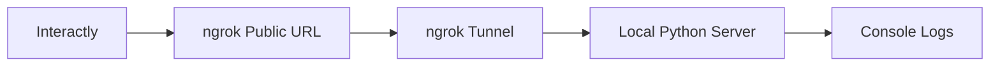

This guide shows you how to set up a local webhook testing environment using ngrok to receive and debug Interactly webhook events during development.

<Info>
    ngrok creates a secure tunnel to your local development server, making it accessible from the internet so Interactly can send webhook events to your local machine.
</Info>

## Prerequisites

Before getting started, make sure you have:
- Python 3.7+ installed
- ngrok account and installation ([Download ngrok](https://ngrok.com/download))
- An Interactly assistant configured for testing

## Setup Overview



<br /><br />

<Frame caption="Overview of the local testing setup with ngrok and a Python webhook server.">
    
</Frame>

## Step 1: Install Dependencies

Create a new directory for your webhook testing server:

<CodeGroup>

    ```bash Terminal
    mkdir interactly-webhook-test
    cd interactly-webhook-test

    # Create virtual environment (recommended)
    python -m venv webhook-env
    source webhook-env/bin/activate  # On Windows: webhook-env\Scripts\activate

    # Install required packages
    pip install flask requests python-dotenv
    ```

    ```bash Alternative with requirements.txt
    # Create requirements.txt
    echo "flask==2.3.3
    requests==2.31.0
    python-dotenv==1.0.0" > requirements.txt

    # Install from requirements
    pip install -r requirements.txt
    ```

</CodeGroup>

## Step 2: Create the Webhook Server

Create a file named `webhook_server.py` with the following code:

<CodeGroup>

    ```python webhook_server.py
    import json
    import os
    from datetime import datetime
    from flask import Flask, request, jsonify
    from dotenv import load_dotenv

    # Load environment variables
    load_dotenv()

    app = Flask(__name__)

    # Configuration
    PORT = int(os.getenv('PORT', 5000))
    SECRET = os.getenv('WEBHOOK_SECRET', '')

    def log_event(event_type, data):
        """Log webhook event with timestamp"""
        timestamp = datetime.now().strftime('%Y-%m-%d %H:%M:%S')
        print(f"\n{'='*60}")
        print(f"[{timestamp}] WEBHOOK EVENT: {event_type}")
        print(f"{'='*60}")
        print(json.dumps(data, indent=2))
        print(f"{'='*60}\n")

    def verify_webhook_secret(headers):
        """Verify webhook secret if configured"""
        if not SECRET:
            return True

        received_secret = headers.get('x-interactly-secret', '')
        if received_secret != SECRET:
            print(f"❌ Secret verification failed!")
            print(f"Expected: {SECRET}")
            print(f"Received: {received_secret}")
            return False
        print("✅ Secret verification passed")
        return True

    @app.route('/webhook', methods=['POST'])
    def handle_webhook():
        """Main webhook endpoint"""
        try:
            # Verify secret if configured
            if not verify_webhook_secret(request.headers):
                return jsonify({'error': 'Unauthorized'}), 401

            # Parse JSON payload
            data = request.get_json()
            if not data:
                return jsonify({'error': 'Invalid JSON'}), 400

            # Extract event type
            event_type = data.get('message', {}).get('type', 'unknown')
            call_id = data.get('message', {}).get('call', {}).get('id', 'unknown')

            # Log the event
            log_event(event_type, data)

            # Handle different event types
            handle_event_by_type(event_type, data)

            # Return success response
            return jsonify({
                'status': 'received',
                'event_type': event_type,
                'call_id': call_id,
                'timestamp': datetime.now().isoformat()
            }), 200

        except Exception as e:
            print(f"❌ Error processing webhook: {str(e)}")
            return jsonify({'error': 'Internal server error'}), 500

    def handle_event_by_type(event_type, data):
        """Handle specific event types with custom logic"""
        call = data.get('message', {}).get('call', {})

        if event_type == 'status-update':
            status = call.get('status', 'unknown')
            duration = call.get('assistantCallDuration', 0)
            print(f"📞 Call Status: {status.upper()}")
            if duration > 0:
                print(f"⏱️  Duration: {duration/1000:.1f}s")

        elif event_type == 'conversation-update':
            messages = data.get('message', {}).get('messages', [])
            if messages:
                latest_msg = messages[-1]
                role = latest_msg.get('role', 'unknown')
                text = latest_msg.get('text', '')
                print(f"💬 {role.title()}: {text}")

        elif event_type == 'end-of-call-report':
            analysis = data.get('message', {}).get('analysis', {})
            summary = analysis.get('summary', 'No summary available')
            success = analysis.get('successEvaluation', 'Unknown')
            cost = call.get('cost', {}).get('totalCost', 0)

            print(f"📋 Call Summary: {summary}")
            print(f"✅ Success Rating: {success}")
            print(f"💰 Total Cost: ${cost:.4f}")

        elif event_type == 'hang':
            print("⏳ Assistant response delayed (5+ seconds)")

        elif event_type == 'error':
            error = data.get('message', {}).get('error', {})
            error_type = error.get('type', 'unknown')
            error_code = error.get('code', 'unknown')
            error_msg = error.get('message', 'No message')

            print(f"🚨 Error Type: {error_type}")
            print(f"🔍 Error Code: {error_code}")
            print(f"📝 Message: {error_msg}")

    @app.route('/health', methods=['GET'])
    def health_check():
        """Health check endpoint"""
        return jsonify({
            'status': 'healthy',
            'timestamp': datetime.now().isoformat(),
            'server': 'Interactly Webhook Test Server'
        })

    @app.route('/', methods=['GET'])
    def welcome():
        """Welcome page"""
        return """
        <h1>🎯 Interactly Webhook Test Server</h1>
        <p>Server is running and ready to receive webhooks!</p>
        <ul>
            <li><strong>Webhook Endpoint:</strong> <code>/webhook</code></li>
            <li><strong>Health Check:</strong> <a href="/health">/health</a></li>
            <li><strong>Method:</strong> POST</li>
        </ul>
        <p>Check your terminal for webhook event logs.</p>
        """

    if __name__ == '__main__':
        print("🚀 Starting Interactly Webhook Test Server...")
        print(f"📡 Listening on port {PORT}")
        if SECRET:
            print(f"🔐 Secret verification enabled")
        else:
            print("⚠️  No secret configured (set WEBHOOK_SECRET in .env)")
        print(f"🌐 Webhook endpoint: /webhook")
        print("="*60)

        app.run(debug=True, port=PORT, host='0.0.0.0')
    ```

    ```python simple_webhook_server.py
    # Simplified version without dependencies
    import json
    from http.server import HTTPServer, BaseHTTPRequestHandler
    from datetime import datetime

    class WebhookHandler(BaseHTTPRequestHandler):
        def do_POST(self):
            if self.path == '/webhook':
                # Read the request body
                content_length = int(self.headers['Content-Length'])
                post_data = self.rfile.read(content_length)

                try:
                    # Parse JSON
                    data = json.loads(post_data.decode('utf-8'))
                    event_type = data.get('message', {}).get('type', 'unknown')

                    # Log the event
                    timestamp = datetime.now().strftime('%Y-%m-%d %H:%M:%S')
                    print(f"\n[{timestamp}] Received {event_type} event:")
                    print(json.dumps(data, indent=2))
                    print("-" * 50)

                    # Send response
                    self.send_response(200)
                    self.send_header('Content-type', 'application/json')
                    self.end_headers()

                    response = {'status': 'received', 'event_type': event_type}
                    self.wfile.write(json.dumps(response).encode())

                except json.JSONDecodeError:
                    self.send_response(400)
                    self.end_headers()
                    self.wfile.write(b'Invalid JSON')
            else:
                self.send_response(404)
                self.end_headers()

        def do_GET(self):
            if self.path == '/':
                self.send_response(200)
                self.send_header('Content-type', 'text/html')
                self.end_headers()
                self.wfile.write(b'<h1>Webhook Server Running</h1><p>POST to /webhook</p>')
            elif self.path == '/health':
                self.send_response(200)
                self.send_header('Content-type', 'application/json')
                self.end_headers()
                self.wfile.write(b'{"status": "healthy"}')
            else:
                self.send_response(404)
                self.end_headers()

    if __name__ == '__main__':
        server = HTTPServer(('0.0.0.0', 5000), WebhookHandler)
        print("🚀 Simple webhook server running on port 5000")
        print("📡 Webhook endpoint: http://localhost:5000/webhook")
        server.serve_forever()
    ```

</CodeGroup>

## Step 3: Configure Environment (Optional)

Create a `.env` file for configuration:

```bash .env
# Webhook server configuration
PORT=5000

# Optional: Set a secret for webhook verification
WEBHOOK_SECRET=your-webhook-secret-here

# Optional: Webhook URL will be set after ngrok setup
WEBHOOK_URL=https://your-ngrok-url.ngrok.io/webhook
```

## Step 4: Start ngrok Tunnel

Open a new terminal and start ngrok:

<CodeGroup>

    ```bash ngrok HTTP
    # Start ngrok tunnel to your webhook server
    ngrok http 5000
    ```

    ```bash ngrok with Custom Domain (Pro plan)
    # Use a custom subdomain (requires ngrok pro)
    ngrok http 5000 --subdomain=myapp-webhooks
    ```

    ```bash ngrok with Auth Token
    # Set auth token if not already configured
    ngrok config add-authtoken YOUR_NGROK_AUTH_TOKEN
    ngrok http 5000
    ```

</CodeGroup>

You'll see output like this:

```
ngrok by @inconshreveable

Session Status                online
Account                      your-email@example.com
Version                      3.1.0
Region                       United States (us)
Web Interface                http://127.0.0.1:4040
Forwarding                   https://abc123.ngrok.io -> http://localhost:5000

Connections                  ttl     opn     rt1     rt5     p50     p90
                            0       0       0.00    0.00    0.00    0.00
```

<Frame caption="Terminal after running the 'ngrok' command forwarding to localhost:8080 — the 'Forwarding' URL is what we want.">
    
</Frame>

<Note>
    **Copy the ngrok URL**: You'll need the `https://abc123.ngrok.io` URL for the next step. This URL changes each time you restart ngrok (unless you have a paid plan with reserved domains).
</Note>

## Step 5: Start Your Webhook Server

In your first terminal, start the Python webhook server:

<CodeGroup>

    ```bash Flask Server
    python webhook_server.py
    ```

    ```bash Simple Server
    python simple_webhook_server.py
    ```

</CodeGroup>

You should see output like:
```
🚀 Starting Interactly Webhook Test Server...
📡 Listening on port 5000
⚠️  No secret configured (set WEBHOOK_SECRET in .env)
🌐 Webhook endpoint: /webhook
============================================================
 * Running on all addresses (0.0.0.0)
 * Running on http://127.0.0.1:5000
 * Running on http://[::1]:5000
```

## Step 6: Configure Interactly Assistant

Now configure your Interactly assistant to use your ngrok webhook URL:

### Via Dashboard UI

1. Go to your Interactly dashboard
2. Select your test assistant
3. Navigate to **Advanced Tab**
4. Scroll to **Server Configuration**
5. Fill in the webhook settings:

| Field    | Value                                                               |
| -------- | ------------------------------------------------------------------- |
| URL      | `https://your-ngrok-url.ngrok.io/webhook`                           |
| Secret   | `your-webhook-secret-here` (if using)                               |
| Messages | Select events to test: `status-update`, `conversation-update`, etc. |

### Via API

<CodeGroup>

    ```bash cURL
    curl -X PATCH "https://api.interactly.ai/assistants/YOUR_ASSISTANT_ID" \
      -H "Authorization: Bearer YOUR_API_KEY" \
      -H "Content-Type: application/json" \
      -d '{
        "assistantServer": {
          "enabled": true,
          "url": "https://your-ngrok-url.ngrok.io/webhook",
          "timeoutSeconds": 20,
          "secret": "your-webhook-secret-here",
          "headers": {
            "X-Test-Header": "webhook-testing"
          },
          "messages": [
            "status-update",
            "conversation-update",
            "end-of-call-report",
            "hang",
            "error"
          ]
        }
      }'
    ```

    ```python Python
    import requests

    assistant_id = "YOUR_ASSISTANT_ID"
    api_key = "YOUR_API_KEY"
    ngrok_url = "https://your-ngrok-url.ngrok.io"

    data = {
        "assistantServer": {
            "enabled": True,
            "url": f"{ngrok_url}/webhook",
            "timeoutSeconds": 20,
            "secret": "your-webhook-secret-here",
            "messages": [
                "status-update",
                "conversation-update",
                "end-of-call-report"
            ]
        }
    }

    response = requests.patch(
        f"https://api.interactly.ai/assistants/{assistant_id}",
        headers={
            "Authorization": f"Bearer {api_key}",
            "Content-Type": "application/json"
        },
        json=data
    )

    print(f"Assistant updated: {response.status_code}")
    ```

</CodeGroup>

## Step 7: Test Your Setup

### Test the Webhook Endpoint

First, verify your webhook endpoint is accessible:

```bash
curl -X POST https://your-ngrok-url.ngrok.io/webhook \
  -H "Content-Type: application/json" \
  -d '{"test": "message"}'
```

### Start a Test Call

1. Go to your Interactly dashboard
2. Start a test call with your configured assistant
3. Speak a few messages
4. End the call

### Monitor the Logs

Watch your webhook server terminal for incoming events:

```
============================================================
[2026-03-05 14:23:15] WEBHOOK EVENT: status-update
============================================================
{
  "message": {
    "timestamp": 1772702523935,
    "type": "status-update",
    "call": {
      "id": "WC-82015760-c3bd-427d-a23b-ba9b07e4ab85",
      "status": "queued",
      ...
    }
  }
}
============================================================

📞 Call Status: QUEUED
```

## Advanced Testing Features

### Event Filtering and Analysis

Add custom filtering to focus on specific events:

```python
# Add to webhook_server.py

FILTERED_EVENTS = ['conversation-update', 'end-of-call-report']

@app.route('/webhook', methods=['POST'])
def handle_webhook():
    data = request.get_json()
    event_type = data.get('message', {}).get('type')

    # Skip filtered events
    if FILTERED_EVENTS and event_type not in FILTERED_EVENTS:
        return jsonify({'status': 'filtered'}), 200

    # Process event...
```

### Save Events to File

Store webhook events for later analysis:

```python
import json
from pathlib import Path

def save_event_to_file(event_type, data):
    """Save webhook events to JSON files"""
    timestamp = datetime.now().strftime('%Y%m%d_%H%M%S')
    filename = f"webhook_events/{event_type}_{timestamp}.json"

    # Create directory if it doesn't exist
    Path("webhook_events").mkdir(exist_ok=True)

    with open(filename, 'w') as f:
        json.dump(data, f, indent=2)

    print(f"💾 Saved event to {filename}")
```

### Metrics Collection

Track webhook statistics:

```python
from collections import defaultdict

class WebhookMetrics:
    def __init__(self):
        self.event_counts = defaultdict(int)
        self.start_time = datetime.now()

    def record_event(self, event_type):
        self.event_counts[event_type] += 1

    def get_stats(self):
        uptime = datetime.now() - self.start_time
        return {
            'uptime_seconds': uptime.total_seconds(),
            'events_received': dict(self.event_counts),
            'total_events': sum(self.event_counts.values())
        }

# Usage in webhook handler
metrics = WebhookMetrics()

@app.route('/metrics', methods=['GET'])
def get_metrics():
    return jsonify(metrics.get_stats())
```

## Troubleshooting

### Common Issues

| Issue                            | Solution                                                |
| -------------------------------- | ------------------------------------------------------- |
| **ngrok tunnel inactive**        | Restart ngrok with `ngrok http 5000`                    |
| **Webhook not receiving events** | Check assistant configuration and ngrok URL             |
| **Secret verification failed**   | Ensure secret matches in both .env and assistant config |
| **JSON decode errors**           | Verify Content-Type header and request format           |
| **Port already in use**          | Change PORT in .env or kill existing process            |

### Debug Mode

Add debug logging to your webhook server:

```python
import logging

logging.basicConfig(
    level=logging.DEBUG,
    format='%(asctime)s - %(levelname)s - %(message)s'
)

@app.route('/webhook', methods=['POST'])
def handle_webhook():
    app.logger.debug(f"Headers: {dict(request.headers)}")
    app.logger.debug(f"Body: {request.get_data()}")
    # ... rest of handler
```

### ngrok Web Interface

Visit `http://localhost:4040` to see:
- Request/response logs
- Traffic inspection
- Tunnel status
- Error diagnostics

## Production Considerations

When moving from testing to production:

1. **Use HTTPS**: Always use HTTPS endpoints in production
2. **Implement Authentication**: Use webhook secrets and additional security
3. **Add Rate Limiting**: Protect against excessive webhook calls
4. **Error Handling**: Implement robust error handling and recovery
5. **Monitoring**: Add proper logging and alerting
6. **Idempotency**: Handle duplicate events gracefully

<Card title="Next Steps" icon="rocket">
    Once your local testing is working, deploy your webhook server to a production environment and update your assistant configuration with the production URL.
</Card>
