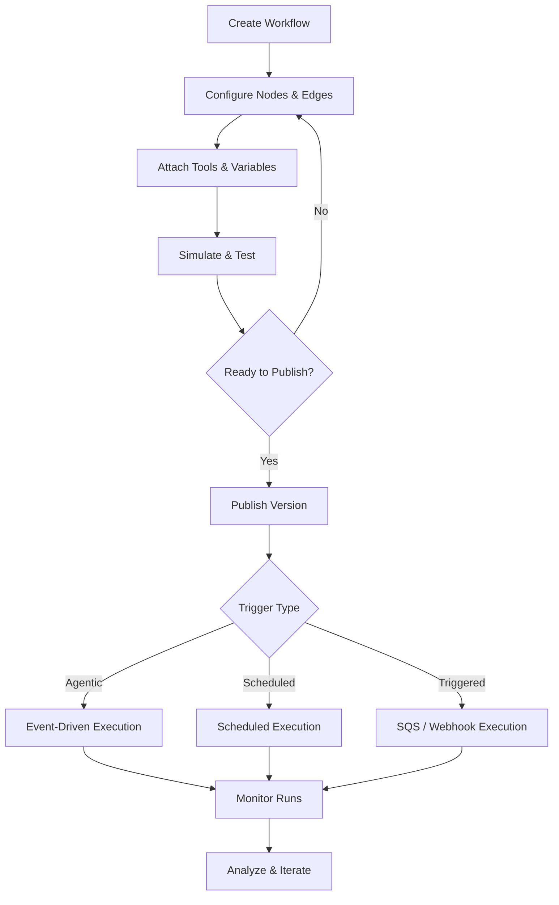

# About

Workflows let you design and automate complex, multi-step AI-driven processes. Each workflow is a graph of connected nodes — from LLM-powered conversation steps to tool calls, HTTP requests, EHR integrations, and more — orchestrated by a runtime execution engine that handles state, routing, retries, and dynamic variable substitution.

<Info>
Workflows are the backbone of Interactly's agentic capabilities. Whether you're automating patient intake, appointment scheduling, or multi-turn conversations, workflows give you full control over logic, branching, and integrations.
</Info>

## Workflow Types

<CardGroup cols={3}>
  <Card title="Agentic Workflow" icon="brain-circuit" href="/workflows/building-a-workflow">
    **Conversational, event-driven execution**
    - Multi-turn LLM-powered conversations
    - Dynamic branching via conditional edges
    - Real-time tool and API calls
    - Triggered by calls, campaigns, or webhooks
  </Card>

  <Card title="Scheduled Workflow" icon="calendar-clock" href="/workflows/scheduled-and-triggered-workflows">
    **Time-based automatic execution**
    - Schedule a one-time run at a specific future datetime
    - Runs without manual intervention
    - Supports all node and tool types
    - Concurrency-controlled execution
  </Card>

  <Card title="Triggered Workflow" icon="bolt" href="/workflows/scheduled-and-triggered-workflows">
    **Event-driven external triggers**
    - SQS message-based execution
    - Inbound webhook triggers
    - Integrate with external systems
    - Real-time response to platform events
  </Card>
</CardGroup>

## Core Concepts

<AccordionGroup>
  <Accordion title="Nodes" icon="circle-nodes">
    Nodes are the building blocks of a workflow. Each node performs a discrete action — generating an LLM response, calling a tool, sending an SMS, querying an EHR, or controlling conversation flow. Interactly supports 26 node types across categories including LLM, Communication, Healthcare (EHR), HTTP, and Workflow Control.

    See [Node Types](/workflows/node-types) for a full reference.
  </Accordion>

  <Accordion title="Edges" icon="arrow-right-arrow-left">
    Edges define how execution flows between nodes. There are three edge types:
    - **Direct Edge** — unconditional transition to the next node
    - **Conditional Edge** — natural language condition evaluated by an LLM to decide the route
    - **Companion Edge** — runs a parallel node alongside the primary flow
  </Accordion>

  <Accordion title="Tools" icon="wrench">
    Tools extend what LLM nodes can do. Attach inbuilt functions, inline Python scripts, external REST APIs, or Knowledge Base queries to any LLM node. Tools are defined in a registry and resolved at runtime with full JSON schema support.

    See [Tools & Integrations](/workflows/tools-and-integrations) for details.
  </Accordion>

  <Accordion title="Global Variables" icon="brackets-curly">
    Global Variables are shared key-value pairs accessible across all nodes in a workflow using `{{variable_name}}` syntax. They support dynamic substitution in prompts, messages, and tool inputs — enabling personalized, context-aware execution at runtime.
  </Accordion>

  <Accordion title="Versions" icon="code-branch">
    Every workflow supports full version history. Changes are tracked as new versions, with a single active version driving live execution. You can view diffs, import/export versions, and roll back at any time without disrupting running workflows.

    See [Workflow Versioning](/workflows/workflow-versioning) for details.
  </Accordion>
</AccordionGroup>

## Key Capabilities

<CardGroup cols={2}>
  <Card title="Multi-LLM Support" icon="microchip">
    Run nodes on any supported LLM provider — Azure OpenAI, OpenAI, Google, Anthropic, AWS Bedrock, or custom endpoints — with automatic fallback groups if a provider is unavailable.
  </Card>

  <Card title="Versioning & Rollback" icon="code-branch">
    Full version history for every workflow. Publish new versions without disrupting active runs. Roll back instantly if needed.
  </Card>

  <Card title="Simulation" icon="flask">
    Compare two workflow configurations head-to-head across multiple automated runs. Evaluate outputs and scores side by side before activating a new version.
  </Card>

  <Card title="Webhook Lifecycle Events" icon="webhook">
    Subscribe to workflow lifecycle events — created, updated, deleted, run started, run completed — delivered via outbound webhooks with exponential backoff retry.
  </Card>

  <Card title="Tool & MCP Integration" icon="plug">
    Attach any combination of inbuilt functions, inline Python, external APIs, or Knowledge Bases to LLM nodes. Supports Model Context Protocol (MCP) for dynamic tool discovery.
  </Card>

  <Card title="DND & Callback Aware" icon="phone-slash">
    Workflows respect Do-Not-Disturb preferences. Post-run analysis can automatically trigger DND entries or schedule callbacks based on conversation outcomes.
  </Card>
</CardGroup>

## Workflow Lifecycle

## Getting Started

<Steps>
  <Step title="Build Your Workflow">
    Navigate to the **Workflows** tab in the dashboard. Click **New Workflow** and start adding nodes from the node palette.
  </Step>

  <Step title="Connect Nodes with Edges">
    Link nodes using Direct, Conditional, or Companion edges. For conditional routing, define natural language conditions — the runtime evaluates them via LLM at execution time.
  </Step>

  <Step title="Attach Tools & Set Variables">
    Add tools to LLM nodes for extended capabilities. Define Global Variables for dynamic data like patient names, appointment times, or custom context.
  </Step>

  <Step title="Simulate Before Publishing">
    Use the Simulation feature to compare two workflow configurations across multiple automated runs, evaluate outputs, and confirm your changes perform as expected.
  </Step>

  <Step title="Publish & Monitor">
    Publish your workflow version and monitor execution runs in real-time via the dashboard or webhook events.
  </Step>
</Steps>

## API Integration

<Card title="Programmatic Workflow Management" icon="code">
All workflow features available in the dashboard are fully accessible via the Workflows API — create, configure, execute, and monitor workflows programmatically.
</Card>

**Available via API:**
- ✅ Workflow CRUD (create, read, update, delete)
- ✅ Version management and publishing
- ✅ Direct workflow execution
- ✅ Run history and checkpointing
- ✅ Schedule management
- ✅ Simulation control
- ✅ Webhook subscription management

<CardGroup cols={2}>
  <Card title="Workflows API" icon="rocket" href="/api-reference/workflows/workflows/create-workflow">
    **POST /api/workflows**
    Create and configure workflows programmatically with full feature parity to the dashboard
  </Card>

  <Card title="Workflow Execution API" icon="play" href="/api-reference/workflows/workflow-execution/execute-workflow">
    **POST /api/workflows/:id/execute**
    Trigger workflow runs directly via API with custom input payloads
  </Card>
</CardGroup>

<Info>
Workflow APIs are ideal for embedding agentic processes into your existing applications, CRM systems, or event-driven pipelines.
</Info>

## Next Steps

<CardGroup cols={2}>
  <Card title="Building a Workflow" icon="hammer" href="/workflows/building-a-workflow">
    Step-by-step guide to creating your first workflow from scratch
  </Card>

  <Card title="Node Types" icon="circle-nodes" href="/workflows/node-types">
    Full reference for all 26 node types across every category
  </Card>

  <Card title="Tools & Integrations" icon="plug" href="/workflows/tools-and-integrations">
    Attach tools, external APIs, and Knowledge Bases to LLM nodes
  </Card>

  <Card title="Workflow Versioning" icon="code-branch" href="/workflows/workflow-versioning">
    Manage versions, publish changes, and roll back safely
  </Card>

  <Card title="Simulation" icon="flask" href="/workflows/workflow-simulation">
    Test workflows interactively before going live
  </Card>

  <Card title="Workflow Webhooks" icon="webhook" href="/workflows/workflow-webhooks">
    Subscribe to lifecycle events for real-time integrations
  </Card>
</CardGroup>
